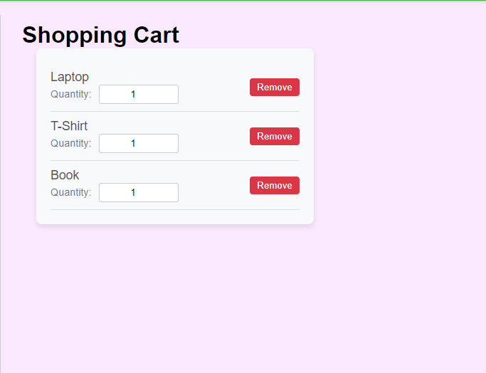

# E-Commerce Web Application

This is a full-stack e-commerce web application built using React for the frontend and Django for the backend. The application allows users to view products, add products to a shopping cart, edit the quantity of products in the cart, and remove products from the cart.

## Table of Contents

- [Features](#features)
- [Technologies Used](#technologies-used)
- [Installation](#installation)
- [Usage](#usage)
- [API Endpoints](#api-endpoints)
- [Screenshots](#screenshots)
- [Contributing](#contributing)
- [License](#license)
- [Contact](#contact)

## Features

- Display products from the database
- View detailed information about a product
- Add products to the shopping cart
- Edit the quantity of products in the cart
- Remove products from the cart

## Technologies Used

### Frontend

- React
- Axios (for API calls)
- Styled Components (for styling)

### Backend

- Django
- Django REST Framework
- PostgreSQL (or any other database supported by Django)

## Installation

### Prerequisites

- Node.js
- npm (or yarn)
- Python 3.x
- pip
- PostgreSQL (or any other database supported by Django)

### Backend Setup

1. Clone the repository:

    ```sh
    git clone https://github.com/luornor/ecomerce.git
    cd ecomerce
    ```

2. Create a virtual environment and activate it:

    ```sh
    python -m venv venv
    source venv/bin/activate  # On Windows use `venv\Scripts\activate`
    ```

3. Install the dependencies:

    ```sh
    pip install -r requirements.txt
    ```

4. Configure the database in `settings.py`.

5. Apply migrations:

    ```sh
    python manage.py migrate
    ```

6. Run the development server:

    ```sh
    python manage.py runserver
    ```

### Frontend Setup

1. Clone the repository:

    ```sh
    git clone https://github.com/luornor/jiji-web.git
    cd jiji-web
    ```

2. Install the dependencies:

    ```sh
    npm install
    # or
    yarn install
    ```

3. Create a `.env` file and add your backend API URL:

    ```env
    REACT_APP_API_URL=http://127.0.0.1:8000
    ```

4. Start the development server:

    ```sh
    npm start
    # or
    yarn start
    ```

## Usage

1. Navigate to the frontend URL (usually `http://localhost:3000`).
2. Browse the products listed on the homepage.
3. Click on a product to view its details.
4. Add the product to the cart.
5. Navigate to the cart to view, edit, or remove items.

## API Endpoints

### Products

- `GET /products/` - List all products
- `GET /products/:id/` - Retrieve a specific product

### Cart

- `GET /cart/` - Retrieve the cart items
- `POST /cart/` - Add an item to the cart
- `PUT /cart/:id/` - Update the quantity of a cart item
- `DELETE /cart/:id/` - Remove an item from the cart

## Screenshots


*Screenshot of the homepage listing products.*


*Screenshot of the product details page.*


*Screenshot of the shopping cart.*

## Contributing

1. Fork the repository.
2. Create your feature branch (`git checkout -b feature/AmazingFeature`).
3. Commit your changes (`git commit -m 'Add some AmazingFeature'`).
4. Push to the branch (`git push origin feature/AmazingFeature`).
5. Open a Pull Request.

## License

This project is licensed under the MIT License.

## Contact

Luornor Nathan Tettey - [tetteynathan89@gmail.com](mailto:tetteynathan89@gmail.com)

Project Link: [https://github.com/luornor/jiji-web.git](https://github.com/luornor/jiji-web.git)
